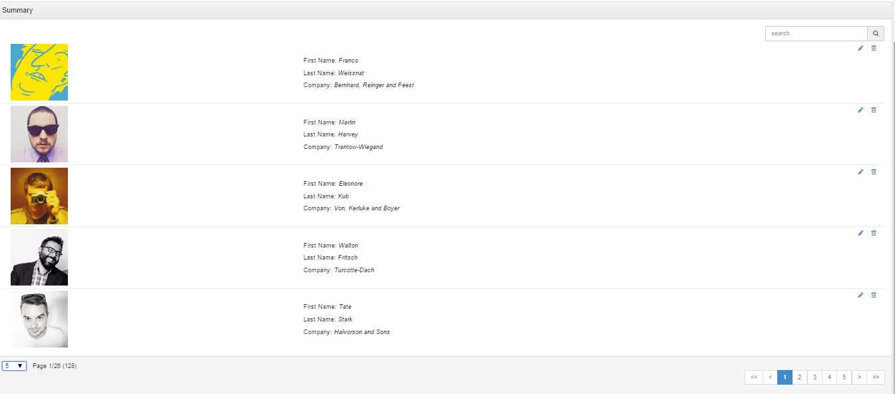

ifraytek-angular-collection-view
================================

Pure AngularJS directive for data tables

For developers, like me, that have found jquery datatable based solution (even with angular-directive wrapper) not good enough may like this. I found myself doing a fair amount of hacking to enjoy the full benefit of angularjs when I use them; like often adding "fnRowCallback" handlers to inject a template and using scope object equivalents to achieve dound-data changes, and in that context doing manual dom transversal to look for a target element and inject my templates. Perharps I am was doing it correctly. This inspired this module. This is a pure angularjs code and normal ng-repeat. The design is based on an abstract collection view hence that tags in this module do not have 'td's or 'table' for that matter. For now only 'table' collection view is supported but it can easily be extended to support other types of list views.

Usage
---------------------------------------------------------------

Include ifraytek.angular.collection.view.js and dependencies on your page and register `it.collections` with your module.
Add `<it-collection-view></it-collection-view>` where you want it
Supported attributes are:

- `data-source` : {String, Array} if a string then the collection source is fetch using $http service. See itArraySourceProvider comments. This is the simplest usage
- `data-fetch` : {fn($options, $callback)} if source is missing then is responsible for fetching collection. The $options object has {offset, limit, search} attributes. The $callback may be used to deliver the result or return a promise or the actual array
- `data-count` : {fn($search, $callback)} if source is missing then this callback is used to get the count
- `data-view-type` : 'table' or 'custom' presenter type
- `data-collection-class`: the class to use on the presenter wrapper. If it is a table this can be 'table-bordered', for example. To achieve a bootstrap panel set this to 'panel'
- `data-body-class` : If the presenter is 'custom' and collection-class is 'panel' set this to 'panel-body' to achieve bootstrap panel body. For table presenter this becomes the class of the 'tbody' tag
- `data-header-class`: If the presenter is 'custom' and collection-class is 'panel' set this to 'panel-heading' to achieve bootstrap panel heading
- `data-footer-class`: If the presenter is 'custom' and collection-class is 'panel' set this to 'panel-footer' to achieve bootstrap panel footer
- `data-collection-style` : The style to use on the presenter wrapper,
- `data-refresh-interval` : If set the collection is refresh every set interval (if refresh of the whole collection is undesirable a better what is to use an array source with the refresh process takinng place in parent scope),
- `paging-control-template-url` : Set this if you want to use a custom paging controls. Make sure the controls call onPageChanged(pageNumber)
- `search-control-template-url` : Set this if you want a custom control for searching. Ensure that you either set ng-change="search(query)" or use ng-click="search(query)" to pass the search to the directive scope
- `data-hide-search` : true/false
- `data-empty-message` : If you want a custom 'empty' message,
- `data-empty-template-url` : If you want a template to be used to render 'empty',
- `loading-message` : If you want a custom 'loading' message,
- `loading-template-url` : If you want to use a template instead for display 'loading' status,
- `data-paging-style` : 'pagination' or 'pager',
- `execute` : A callback that gets generic commands fired from an event in the collection view. The command may trigger via any UI event like click. The expression to trigger the command must be: 'command(name, args)'. The execute callback then gets 'fn($name, $arg1[, $arg2, ....])' The number of 'argn' arguments depend on what is passed to 'command(name, args)'
- `data-paging-info-class` : The css class to use on the paging info element (i.e that shows ),
- `hide-paging-info` : '@'

This sample shows supported tags available in this module
- `it-collection-view`: root directive tag
-- `it-header-row` (optional) if you want a 'header' on your list view
-- `it-body-row` the root tag that displays a row (if the parent is a table this becomes a 'tr' element)

You can have as many `it-body-row` as you like. In that case `data-ng-repeat-start` and `data-ng-repeat-end` are used. The 'row' tags can have as many of
- `it-cell-static` if you want a 'cell' (if that parent is a table this could be a 'td' or 'th' tag) that you have absolute control of what is rendered.
- `it-cell` (this does the same thing as `it-cell-static`) if you want a 'cell' (if that parent is a table this could be a 'td' or 'th' tag) that you have absolute control of what is rendered.
- `it-cell-bind` if you just want to pass the name of the propery of the model item that is interpolated here
- `it-cell-html` (I discovered later that this is needless). What you put here is wrapped in `data-ng-bind-html` attribute
- `it-cell-template` what you put here is a templateUrl. You can optionally give it (using 'data-model="..."' attribute) a model name that you want to use in the fragment pointed to. It should be obvious this is achievable with an 'ng-include' inside a 'it-cell-static' tag; that is how it is implemented anyway.

You can transfer common html attributes on the tags listed above including 'ng-click'. It's just that 'ng-click' is treated in a specific way. I am still new in the *angularjs* game. Don't know why an expression like `ng-click="$parent.doSomething()"` isn't working on the parent scope. For now the only way to respond to such behavior is to do: `ng-click="command(<name>, ...)"`. The directive allows the parent scope to respond to such commands by dispatching to an external `execute($name, $arg1[, $arg2]...)` expression on the parent scope (note that 'ng-click' is not the only way to trigger this command). The parent scope is then free to handle as sees fit. `$name` argument passed to the method can be used to target a specific action. Each cell/row has access to the normal scope variable available via 'ng-repeat'. By default this is `$model` but this can be changed. Just pass `data-item-model="<name>"` attribute. _the screenshot above shows this_.

The sample below will output a div having bootstrap panel class
    <it-collection-view data-source="source"
         execute="command($name, $arg1, $arg2)"
         data-paging-style="pagination"
         data-item-model="human" data-view-type="custom"
         data-collection-class="panel panel-default"
         data-header-class="panel-heading"
         data-body-class="panel-body"
         data-footer-class="panel-footer"
         data-page-sizes="5,10,20"
         data-page-size="10">
              <!-- data-sort-list creates a dropdown of sort fields appropriate for a single-column list view -->
        <it-header-row class="panel-title" tag="h2" data-sort-list='{"firstName" : "First Name", "lastName" : "Last Name"}'>
            <it-cell>Summary</it-cell>
        </it-header-row>
        <it-body-row>
            <it-cell>
               

                   

                      
                   

                   

                       

                            <a href="#" ng-click="command('edit', human)"><i class="fa fa-pencil"></i></a>
                            &nbsp;&nbsp;
                            <a href="#" ng-click="command('delete', human)"><i class="fa fa-trash-o"></i></a>
                       

                        First Name: <em>{{human.firstName}}</em>
                        Last Name: <em>{{human.lastName}}</em>
                        Company: <em>{{human.company}}</em>
                  

              

           </it-cell>
        </it-body-row>
    </it-collection-view>
	
Result:

This will create a table:
    <it-collection-view data-source="source"
         execute="command($name, $arg1, $arg2)"
         data-paging-style="pagination"
         data-item-model="human" data-view-type="table" data-collection-class="table-bordered hot">
       <it-header-row>
          <it-cell>&nbsp;</it-cell>
          <it-cell data-sortable="true" data-property="firstName">First Name</it-cell>
          <it-cell data-sortable="true" data-property="lastName">Last Name</it-cell>
          <it-cell data-sortable="true" data-property="company">Company</it-cell>
          <it-cell>Greeting</it-cell>
          <it-cell data-tag="td">Actions</it-cell>
       </it-header-row>
       <it-body-row>
          <it-cell class="text-right bg-primary">
            <b>
              {{$index + 1}}
            </b>
          </it-cell>
          <it-cell>{{human.firstName}}</it-cell>
          <it-cell-bind>lastName</it-cell-bind>
          <it-cell-bind>company</it-cell-bind>
          <it-cell-template data-model="person">greeting-cell.html</it-cell-template>
          <it-cell class="text-right">
             <a href="#" ng-click="command('edit', human)"><i class="fa fa-pencil"></i></a>
                &nbsp;&nbsp;
             <a href="#" ng-click="command('delete', human)"><i class="fa fa-trash-o"></i></a>
          </it-cell>
      </it-body-row>
    </it-collection-view>

Result:

Dependencies
--------------------------------------------
* [angular-ui-bootstrap]: http://angular-ui.github.io/bootstrap "angular-ui-bootrap": used its pagination
* [angular]: https://docs.angularjs.org "angular"
* [bootstrap]: http://getbootstrap.com "bootstap"
* [jquery]: http://jquery.com, "jquery"

Icon Support
--------------------------------------------
I have tried to make the icon usage loose. For now [Font Awesome](http://fortawesome.github.io/Font-Awesome, "Font Awesome") and bootrap3 are supported. To switch at config time which icon pack is used do this:

`module.config(['itCollectionOptions', function (itCollectionOptions) {`
	`itCollectionOptions.icons["default"] = "bs3" //can be 'fa';`
`}])`

A directive (`it-icon='<generic name>'`)  is used to automatically determine which icon pack is preferred. A few standard icons are declared. Anyother icon is guessed at.

License: MIT

