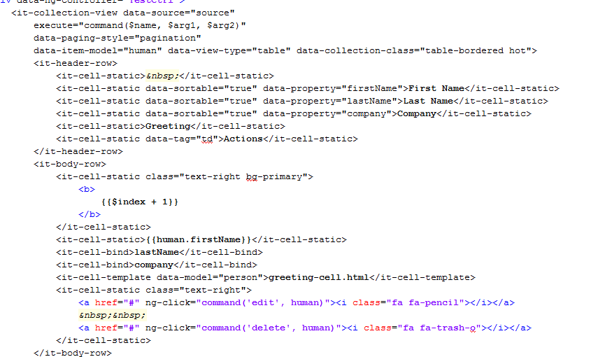

ifraytek-angular-collection-view
================================

Pure AngularJS directive for data tables

For developers, like me, that have found jquery datatable based solution (even with angular-directive wrapper) not good enough may like this. I found myself doing a fair amount of hacking to enjoy the full benefit of angularjs when I use them; like often adding "fnRowCallback" handlers to inject a template and using scope object equivalents to achieve dound-data changes, and in that context doing manual dom transversal to look for a target element and inject my templates. Perharps I am was doing it correctly. This inspired this module. This is a pure angularjs code and normal ng-repeat. The design is based on an abstract collection view hence that tags in this module do not have 'td's or 'table' for that matter. For now only 'table' collection view is supported but it can easily be extended to support other types of list views. 

Sample
---------------------------------------------------------------
The test document provider contains this fragment:

This sample shows supported tags available in this module
- `it-collection-view`: root directive tag
-- `it-header-row` (optional) if you want a 'header' on your list view
-- `it-body-row` the root tag that displays a row (if the parent is a table this becomes a 'tr' element)

You can have as many `it-body-row` as you like. In that case `data-ng-repeat-start` and `data-ng-repeat-end` are used. The 'row' tags can have as many of
- `it-cell-static` if you want a 'cell' (if that parent is a table this could be a 'td' or 'th' tag) that you have absolute control of what is rendered.
- `it-cell-bind` if you just want to pass the name of the propery of the model item that is interpolated here
- `it-cell-html` (I discovered later that this is needless). What you put here is wrapped in `data-ng-bind-html` attribute
- `it-cell-template` what you put here is a templateUrl. You can optionally give it (using 'data-model="..."' attribute) a model name that you want to use in the fragment pointed to. It should be obvious this is achievable with an 'ng-include' inside a 'it-cell-static' tag; that is how it is implemented anyway.
 
You can transfer common html attributes on the tags listed above including 'ng-click'. It's just that 'ng-click' is treated in a specific way. I am still new in the *angularjs* game. Don't know why an expression like `ng-click="$parent.doSomething()"` isn't working on the parent scope. For now the only way to respond to such behavior is to do: `ng-click="command(<name>, ...)"`. The directive allows the parent scope to respond to such commands by dispatching to an external `execute($name, $arg1[, $arg2]...)` expression on the parent scope (note that 'ng-click' is not the only way to trigger this command). The parent scope is then free to handle as sees fit. `$name` argument passed to the method can be used to target a specific action. Each cell/row has access to the normal scope variable available via 'ng-repeat'. By default this is `$model` but this can be changed. Just pass `data-item-model="<name>"` attribute. _the screenshot above shows this_.

There are three ways to pass data to this directive:

1. Set `data-source='...'` attribute that points to an array in scope.
2. Set `data-source='path'` attribute that holds a string that points to a http source of the data.
3. Set `data-fetch='fn($fetch, $callback)'` a scope method that is called this: `fetch($options, $callback)`. The `$options` object has the attributes: offset:number, limit:number and search:string. This gives the parent a scope the opportunity to fetch the data anyhow. A promise may be returned or the `$callback` function utilized to dispatch the result. 

Using `data-fetch="...` option also requires that the scope provides a way to serve total result count. This is done by passing `data-count='fn($search, $callback)'`. As above the callback may not be used. The count may be returned as a return value for the method, a promise or with the `$callback`. Same goes for `fetch`. 

The provided sample produces this:

Requirements
--------------------------------------------
* [angular-ui-bootstrap](http://angular-ui.github.io/bootstrap, "angular-ui-bootrap"): used its pagination
* [angular](https://docs.angularjs.org, "angular")
* [bootstrap](http://getbootstrap.com/, "bootstap")
* [jquery](http://jquery.com, "jquery")
* 
Icon Support
--------------------------------------------
I have tried to make the icon usage loose. For now [Font Awesome](http://fortawesome.github.io/Font-Awesome, "Font Awesome") and bootrap3 are supported. To switch at config time which icon pack is used do this:

`module.config(['itCollectionOptions', function (itCollectionOptions) {`
	`itCollectionOptions.icons["default"] = "bs3" //can be 'fa';`
`}])`

A directive (`it-icon='<generic name>'`)  is used to automatically determine which icon pack is preferred. A few standard icons are declared. Anyother icon is guessed at.
